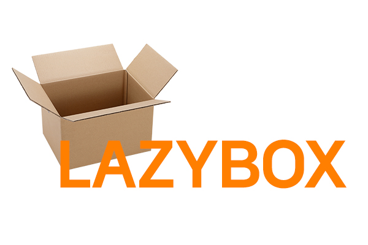

# LazyBox
--------------------

## 개요
 이 프로젝트는 마치 **BusyBox**와 같이 리눅스 시스템 상에서 매우 단순하지만 유용하게 동작하는 종합 유틸리티 프로그램이다. (작성한 Makefile에 컴파일러를 명시함으로써) BeaglePlay 보드에서 동작할 수 있도록 설계하였으며, 물론 Makefile에 명시된 컴파일러를 수정하면 일반적인 리눅스 시스템에서도 동작하는 프로그램이다.

다음 아래는 이 프로그램을 실행해서 사용할 수 있는 명령들이다.

- cat
- grep
- cp
- mv
- rm
- ls

    
## 설치 방법
   
 1. 리눅스 터미널에서 `git clone https://github.com/ultisy/lazybox.git` 명령어를 수행해 이 저장소를 클론한다.
 2. `make` 명령어를 수행한다. **(주의 - "aarch64-linux-gcc" 컴파일러로 컴파일하므로, 해당 컴파일러가 있는 디렉토리에서 수행할 것.)**
 3. `lazybox`라는 실행 가능한 바이너리 파일이 생성될 것이다. 이 파일을 BeaglePlay 보드의 구성된 VFS로 이동시킨다.
 4. BeaglePlay 보드를 동작시킨 뒤(-SSH 연결), `./lazybox` (-루트 디렉토리에 파일을 저장한 경우) 명령을 수행해 프로그램이 잘 동작하는지 확인한다.

 ## 프로젝트 참여 멤버
 - 이용위
 - 유승현